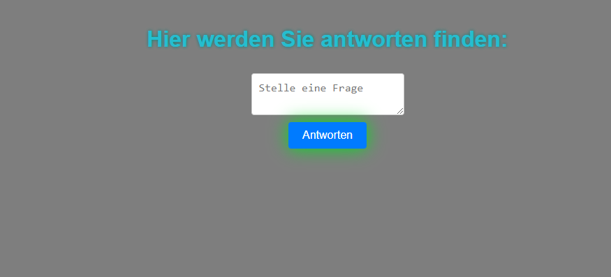

# wisemen-for-fun

Willkommen zu "wisemen-for-fun" - einem unterhaltsamen Projekt, das Ihnen humorvolle Antworten auf Ihre Fragen bietet!

## Preview

## Hinweis

Dieses Programm ist rein zu Unterhaltungszwecken gedacht und sollte nicht ernsthaft verwendet werden. Die Antworten sind nicht dazu bestimmt, ernsthafte Fragen zu beantworten oder als verlässliche Informationen betrachtet zu werden.

## Beschreibung

"wisemen-for-fun" ist ein einfaches Webprojekt, das eine interaktive Benutzeroberfläche bereitstellt, um Fragen zu stellen und spaßige Antworten zu erhalten. Das Projekt kombiniert HTML, CSS und JavaScript, um eine ansprechende und animierte Benutzeroberfläche zu erstellen.

## Funktionen

- Stellen Sie eine Frage in das Eingabefeld.
- Klicken Sie auf den "Antworten" Button, um eine unterhaltsame Antwort auf Ihre Frage zu erhalten.
- Genießen Sie die animierte Gestaltung der Webseite und die humorvollen Antworten!

## Technologien

Dieses Projekt verwendet die folgenden Technologien:

- HTML: Für die Struktur der Webseite.
- CSS: Für das Styling und die Animationen.
- JavaScript: Um die Interaktivität zu ermöglichen und Antworten auf Fragen zu generieren.

## Anwendung

1. Öffnen Sie die `index.html` Datei in Ihrem bevorzugten Webbrowser.
2. Geben Sie Ihre Frage in das Textfeld "Stelle eine Frage" ein.
3. Klicken Sie auf den "Antworten" Button.
4. Die Antwort auf Ihre Frage wird im Abschnitt unterhalb der Eingabe angezeigt.

Bitte denken Sie daran, dass die Antworten rein zufällig und humorvoll sind, und nicht dazu gedacht sind, ernsthafte Informationen zu liefern.

## Autor

Dieses Projekt wurde mit Liebe zum Spaß von Satisfraction erstellt.

## Lizenz

Dieses Projekt ist unter der [MIT Lizenz](https://opensource.org/licenses/MIT) veröffentlicht. Beachten Sie, dass die Lizenz nur für den Quellcode des Projekts gilt und nicht für die erzeugten Antworten.

---

**Hinweis:** Dieses Programm ist nur für Unterhaltungszwecke gedacht. Die generierten Antworten sollten nicht als ernsthafte Informationen betrachtet werden. Verlassen Sie sich bitte nicht auf die hier bereitgestellten Antworten für wichtige Entscheidungen oder Informationen. Verwenden Sie dieses Projekt auf eigene Verantwortung.
